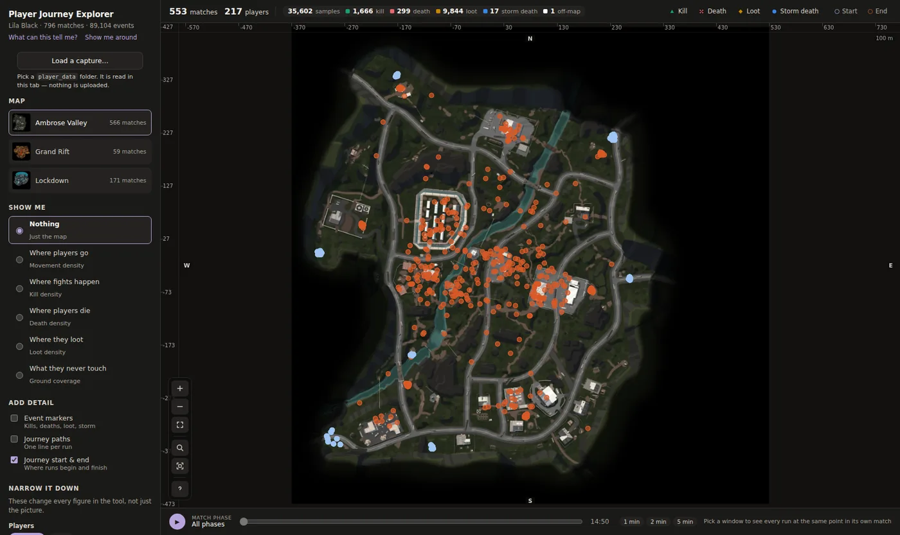
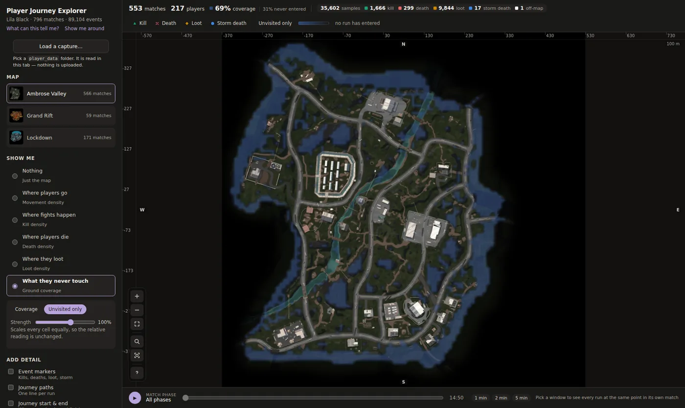
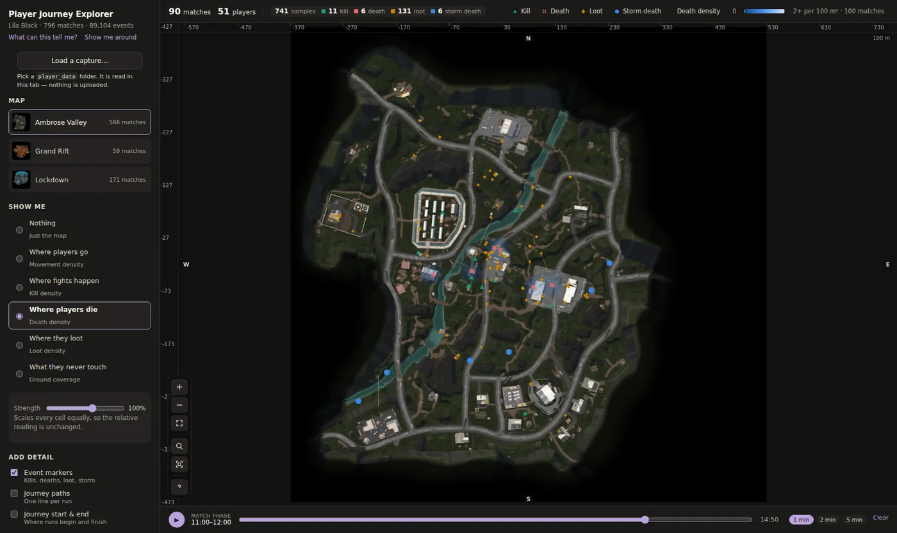
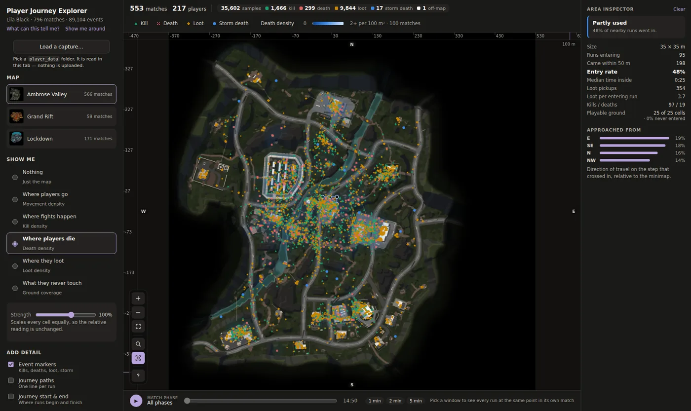

# Three things the data says about Lila Black

All figures come from the five-day dataset (Feb 10–14 2026; 89,104 events, 796
matches, 245 human players). The maps and counts can be checked in the deployed
tool; the tables (hazard by minute, per-cell lethality, trade ratios) were
computed offline from the same payloads the tool ships.

---

## 1. The map is played as spokes, not as a ring — and the rim is dead because nothing asks anyone to go sideways

**What caught my eye.** Turning on journey start and end points, the starts did
not scatter. They stacked into a handful of tight clusters on the map edge,
while the ends spread right across the interior.

**The evidence.** Taking the first and last movement sample of every human
journey, over a ~10 m grid:

| Map | Human journeys | Distinct start cells | Share of playable ground | Top 10 cells hold |
|---|---|---|---|---|
| Ambrose Valley | 554 | **22** | 0.5% | **81%** of all starts |
| Lockdown | 170 | 21 | 0.5% | 76% |
| Grand Rift | 57 | 16 | 0.4% | 83% |

Median distance from map centre is **0.43 for starts against 0.22 for ends** on
Ambrose Valley, and the same inward pull holds on all three maps. Ground never
entered by a human run is **30.8%** of Ambrose Valley, **58.8%** of Lockdown and
**61.0%** of Grand Rift, and it forms a near-continuous band around the
perimeter — about twenty hot pinpricks on the rim and nothing between them.

And the dead ground is not remote ground:

| Map | Never entered | Remote (no traffic within 50 m) | **Bypassed** |
|---|---|---|---|
| Ambrose Valley | 30.8% | **0.8%** | **99.2%** |
| Lockdown | 58.8% | 32.1% | 67.9% |
| Grand Rift | 61.0% | 0% | 100% |

Counting bot traffic as well, unused ground falls to 26.7%, 51.8% and 50.2% —
bots reach ground humans never touch. Bot paths are nav-mesh output rather than
choice, so the humans-only figure is the one that describes design intent.

**What it means.** The map has a spoke structure that its geometry does not
show. Every run begins at one of twenty fixed points, and everything of value is
inward, so the first stretch of every run is scripted by geography before the
player makes a decision. The rim is dead not because it is far — on Ambrose
Valley players walk within 50 m of 99.2% of the ground they never enter — but
because a run goes from its spawn to the centre and nothing in the match ever
makes the lateral ring a destination. It is a corridor with nowhere to go.

Two consequences follow. The effective map is smaller than the drawn map, so
the POI density and encounter spacing the level was balanced for are not the
ones players experience, and anything placed on the rim — cover, loot,
sightlines — is budget on ground no one stands on. And the shape of every run
is fixed at the moment it starts, which means the map only ever gets tested
from the same approaches: any design that assumes a POI can be reached from an
unpredictable direction is not being exercised.

The end points carry a second finding. Ends are dispersed — 286 distinct cells
against 22 starts on Ambrose Valley, with no clustering at all. If runs were
finishing at fixed extraction points the ends would cluster the way the starts
do. They do not, and the reason is that **57% of runs end in a death** rather
than an extraction. The schema has no `Extract` event to confirm the other 43%,
which is itself worth raising.

Lockdown is the counter-case: a third of its dead ground genuinely is remote,
with no traffic within 50 m. That is a connectivity problem, and it needs a
different fix from Ambrose Valley's.

**What to change, and what moves.** Not the geometry, on Ambrose Valley. Spawns
are already on the rim, so adding more will not populate it; what is missing is
a reason to travel *along* it — lateral objectives, routes between spawn
clusters, or extraction placed outward so a run ends where it began. On
Lockdown, a third of the unused ground needs a path before incentive matters.
And if the studio would rather accept the observed shape, shrinking the
playable bounds reclaims the art, collision and nav-mesh budget the dead band
currently costs. Metrics affected: map utilisation, route diversity per player,
share of runs traversing the rim laterally, POI visit distribution, streaming
budget if the bounds change.

**Why a level designer should care.** Twenty-two entry points on a 900 m map is
a tight constraint on route variety, and it is worth knowing before attributing
repetitive play to the layout. The layout may be fine. The spawns are what make
every run look the same.

---

## 2. The storm is a working mechanic that fires into an empty room — and until it fires, nothing in the match escalates

**What caught my eye.** 39 storm deaths in five days looked low for a mechanic
the brief calls out by name. Scrubbing runs on the timeline showed why:
everyone who died to it died at nearly the same clock time, and most runs were
already over by then.

**The evidence.**

| | |
|---|---|
| Storm deaths, all maps, five days | **39** (5.3% of all deaths) |
| **Earliest storm death in the dataset** | **655 s (10:55)** |
| Median storm death | 739 s (12:19) |
| **Median run length** | **382 s (6:22)** |
| Runs ending before the earliest storm death | **656 of 796 (82%)** |
| Runs ending before the median storm death | 732 (92%) |

And the shape of risk over a run — the chance of dying in each minute, given
the player is still alive at its start:

| Minute of run | Chance of dying that minute |
|---|---|
| 0–1 | 1.4% |
| 1–2 | 5.8% |
| **2–11** | **7–10%, flat** |
| 11–12 | 13% |
| 12–14 | **24%** |

A note on what is being measured. The capture holds one participant's telemetry
for 744 of 796 matches, so run length here is how long a *run* lasted, not how
long the match ran — matches where more than one participant was captured span
8.6 min at the median against 6.2 for the rest. The finding is unaffected, since
a storm that fires at eleven minutes cannot reach a player who left at six, but
the figures describe runs and are written that way.

**What it means.** Two things, and the second matters more than the first.

The storm is not weak. When it arrives, the chance of dying in a given minute
goes from about 9% to 24% — it nearly triples lethality. It does exactly what a
storm is for. It just does it after four runs in five have ended.

The finding is what happens *before* it arrives: the hazard is flat. Minute nine
is as dangerous as minute three. Nothing about staying longer costs more, so
nothing ever tells a player it is time to leave. In an extraction game that
curve is supposed to rise, because a rising curve is what turns "keep looting"
into a decision rather than a default. Here the only thing that makes it rise
is the storm, and the storm is scheduled for a match length this game does not
produce — an eleven-minute first ring for runs that are over at six.

So runs end for two reasons and the storm is neither of them. About half end in
death to bots, at that constant ~9% a minute; the rest leave when they run out
of reasons to stay. Neither group ever meets the mechanic that was meant to
shape the end of their match. The storm was tuned for a match length this game
is not producing.

**What to change, and what moves.** A timing value, not geometry, which makes
this the cheapest of the three to act on. Pull the first lethal ring inside the
median run — under six minutes — and the storm becomes the escalation the rest
of the map was designed around. The alternative, giving runs a reason to last
past eleven minutes, is a content problem and far more expensive. One honest
risk: players are already dying to bots at a steady rate, so bringing the storm
forward on its own shortens those runs further. It should move together with
bot density, not alone. Metrics affected: storm share of deaths, median run
length, extraction success rate, the distribution of run-end reasons.

**Why a level designer should care.** The storm is the map's tempo instrument.
It is what converts open space into a sequence of decisions — when to commit to
a POI, which route out, where the pinch will be. Every piece of design that
assumes storm pressure — escape routes, choke timing, extraction placement
relative to the shrink — is untested in production. And it explains finding 1:
with no inward pressure, nothing ever pushes players off the routes they already
prefer, so the perimeter stays dead.

---

## 3. A handful of places do most of the killing — and the data can tell which of them are broken

**What caught my eye.** The death overlay did not look like the traffic overlay.
Deaths clustered in places that traffic alone did not explain.

**The evidence.** Over 38 m cells, counting only cells that ten or more runs
passed through, and measuring deaths per run passing through — so busy ground
does not inflate it and a run that died early cannot bias it:

| | Ambrose Valley | Lockdown |
|---|---|---|
| Human deaths | 299 | 80 |
| Map-average lethality | 2.8 per 100 runs | 3.0 |
| Eight most lethal cells hold | **30% of deaths** | **38% of deaths** |
| …on this share of run-visits | 6% | 6% |
| Most lethal single cell | 19.4 per 100 runs (**6.9×** average) | 27.9 per 100 runs (**9.5×** average) |

The cells are spread across each map, not one cluster. On Ambrose Valley the
five worst each had between 60 and 116 runs through them — this is not noise.
Grand Rift has 16 human deaths in total, too few to say anything, and I have
not tried.

Map-wide, a player kills between five and six bots for every death. At the
hotspots that ratio splits two ways:

| Cell (world x, z) | Runs through | Deaths | Kills | Trade (K:D) |
|---|---|---|---|---|
| Ambrose (24, −4) | 101 | 14 | 64 | **4.6** |
| Ambrose (99, −79) | 116 | 21 | 71 | 3.4 |
| Lockdown (104, −21) | 43 | 12 | 34 | 2.8 |
| Ambrose (−126, 146) | 27 | 3 | 2 | **0.7** |
| Lockdown (−229, 188) | 17 | 3 | 0 | **0.0** |

The Area Inspector snaps a box to the tool's ~9 m coverage cells, so the same
spot reads 97 kills against 19 deaths there rather than the table's 64 and 14 —
a slightly larger area, the same roughly five-to-one trade.

**What it means.** If deaths simply followed traffic, lethality per visit would
be roughly even across the map. It is not — a few cells are five to nine times
more lethal than the average, on well-travelled ground — so something about
those specific places is killing players, not just the number of players
passing through.

But a death hotspot on its own does not tell you whether that is a problem. The
game's own standard for a normal encounter is a player beating several bots.
Where a hotspot keeps that trade — (24, −4) on Ambrose Valley, 64 kills against
14 deaths — players are dying because they are fighting, and mostly winning.
That is a contested zone doing its job; it is the kind of encounter the map
should have more of. Where a hotspot inverts the trade — Lockdown (−229, 188),
three deaths and not one kill — players are dying without landing a hit, which
means they were effectively dead before they could respond: a sightline they
cannot see from, a bot cluster with no cover on the approach, an arrival point
in view of something. The game's own K:D is the yardstick, and those places
fail it.

That distinction is the insight. A death heatmap shows *where*; the trade ratio
at each spot shows *whether* it is design working or design failing. The
one-sided examples are small samples — three deaths each — so they are places
to look, not verdicts. The contested ones are well-established.

**What to change, and what moves.** Per spot, and cheap. Drop the Area
Inspector on the one-sided coordinates, walk in-editor from the direction
players approach, and see what they see on arrival. The fix is usually one
thing — a cover piece, a bot spawn moved twenty metres, a sightline broken. Leave
the contested hotspots alone. Metrics affected: lethality per visit at the named
cells, trade ratio at those cells, share of all deaths held by the top ten
cells.

**Why a level designer should care.** Most of the map's danger lives in about
six percent of its visited ground. That is not a flaw — concentration is what
makes an encounter legible — but it means the quality of the whole map's combat
rests on a small number of places, and the data can rank them by whether the
player was given a fair chance. Reading the death overlay and the kill overlay
together, at the same spot, is the difference between "people die here" and
"people die here without getting to fight," and only the second one tells you
what to fix.

---

## Also worth flagging

**Players are not coming back.** Unique humans per day run 98 → 80 → 59 → 47
across Feb 10–13 (Feb 14 is a partial day), and only 40 of 245 players appear on
more than one day — a 16% return rate. Matches per day fall 287 → 197 → 162 →
112 over the same window.

**There is playable ground the minimap doesn't draw.** 39 events sit outside
Grand Rift's drawn landmass, clustered just off the southern shoreline below
Labour Quarters — and 17 of them are loot pickups. Players cannot loot where they
cannot stand, so either the art is missing a ledge or the collision volume
extends past the intended bounds. Worth a look in-editor; it is visible in the
tool as a white ring around the affected markers.
